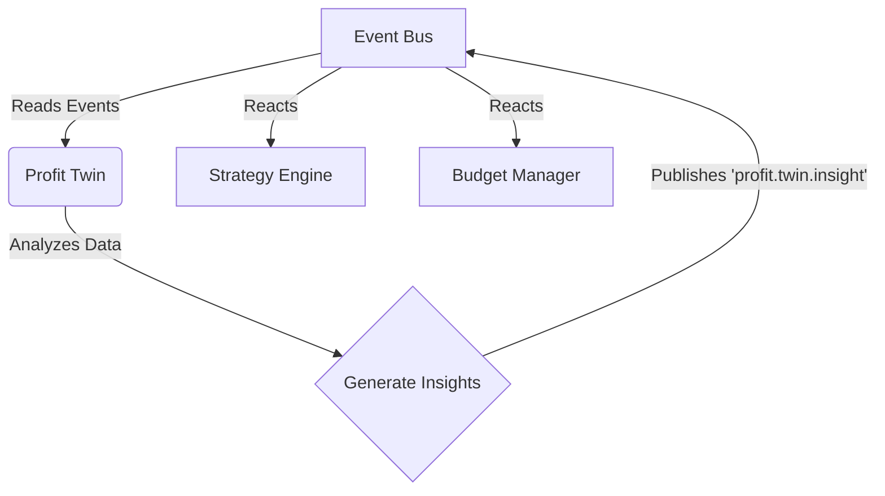

# OCTOPUS OS Phase 2: Profit Engine Architecture Specification

This document details the fully modular architecture for the Profit Engine as implemented in Phase 2.

## 1. Modular Decomposition
The Profit Engine is no longer a monolith. It has been decomposed into 11 independent, focused packages.

### Package List
- **@workspace/profit-memory**: Sales logs, attribution, ROI records.
- **@workspace/profit-twin**: Observer-only financial analytics agent.
- **@workspace/knowledge-graph**: Abstract store with SQL backend, designed for future Neo4j support.
- **@workspace/strategy-engine**: Milestone tracking and pivot decisions.
- **@workspace/goal-engine**: $1k → $1M milestone definitions and progress.
- **@workspace/budget-manager**: Budget allocation across channels.
- **@workspace/experiment-engine**: A/B test runner (landers, copy, creative).
- **@workspace/network-adapters**: Provider-adapter contracts with integrations for various affiliate networks.
- **@workspace/viral-detector**: Trend scanning and opportunity scoring.
- **@workspace/self-evolution**: Proposal gate (Proposal → Test → Simulation → Approval).
- **@workspace/business-policy**: Company law engine enforcing strict financial/ethical rules.
- **@workspace/profit-engine**: Thin coordinator/orchestrator wrapping the above engines.

## 2. Event-Driven Architecture and Profit Twin

The **Profit Twin** acts as a pure observer. It never writes directly to the database. Instead, it reads from the Event Bus, generates insights, and publishes new events that the rest of the system reacts to.



## 3. Abstract Knowledge Graph Store

Data relationships (e.g., campaigns driving sales via specific keywords) are modeled in a Knowledge Graph. Currently backed by PostgreSQL (via Drizzle ORM) but abstracted to allow a seamless swap to Neo4j.

## 4. Business Policy Engine

This is a hard gate for all agent actions, distinct from the system Rule Engine. It enforces constraints such as:
- `MAX_SPEND_PER_DAY`
- `MIN_COMMISSION_RATE`
- `SCALE_AFTER_N_SALES`
- `BANNED_NICHES`

## 5. Approval Modes & LEARNING Mode

Operating modes include `AUTO`, `SEMI_AUTO`, `MANUAL`, and `LEARNING`.
- **LEARNING Mode (Paper Trading)**: Executes all actions with virtual money to test strategies safely without actual spend.

## 6. Self-Evolution Safety Gate

The system can propose improvements (e.g., new rules, policies, or workflows) but cannot deploy them directly.

```mermaid
graph TD
    A[Evolution Agent] -->|Identifies Improvement| B[Creates Proposal]
    B --> C[Simulation Engine (LEARNING mode)]
    C --> D{Confidence Score > 95%?}
    D -- Yes (if AUTO) --> E[Auto Deploy]
    D -- No (or if MANUAL) --> F[Human Approval]
    F -->|Approved| E
```
